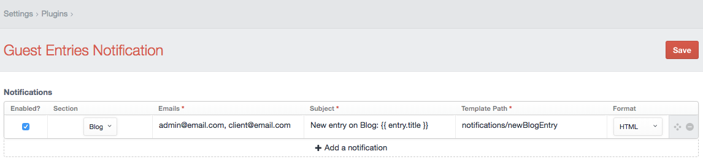

 

# Guest Entries Notification plugin for Craft CMS

Extend Pixel &amp; Tonic&rsquo;s [Guest Entries (v1)](https://github.com/craftcms/guest-entries/tree/v1) plugin with email notifications.

**NOTE: this plugin requires the Guest Entries plugin to be installed and configured.**

## Installation

To install Guest Entries Notification, follow these steps:

1. Download & unzip the file and place the `guestentriesnotification` directory into your `craft/plugins` directory
2.  -OR- do a `git clone https://github.com/dative/guestentriesnotification.git` directly into your `craft/plugins` folder.  You can then update it with `git pull`
3.  -OR- install with Composer via `composer require dative/guestentriesnotification`
4. Install plugin in the Craft Control Panel under Settings > Plugins
5. The plugin folder should be named `guestentriesnotification` for Craft to see it.  GitHub recently started appending `-master` (the branch name) to the name of the folder for zip file downloads.

Guest Entries Notification works on Craft 2.4.x and Craft 2.5.x.

## Guest Entries Notification Overview

I've used the [wbrowar/Craft-Guest-Entries-Email-Notification](https://github.com/wbrowar/Craft-Guest-Entries-Email-Notification) in the past, but I felt it lack support for multiple notifications hooks for the same Guest Entry section, and the ability to use templates for the email body.

## Configuring Guest Entries Notification

Once you finish configuring Guest Entries, go to Guest Entries Notification settings:

## Guest Entries Notification Roadmap

Some things to do, and ideas for potential features:

* Release it

Brought to you by [Dative, Inc](https://hellodative.com/)
